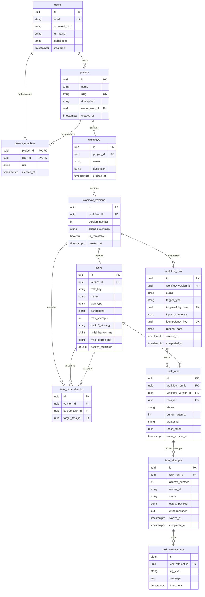

# FlowForge Relational Persistence Model Specification

This document defines the relational data architecture for **FlowForge** in PostgreSQL. It specifies entity schemas, primary and foreign key constraints, composite relational integrity, indexes, lifecycle state constraints, and domain invariant enforcements.

---

## 1. Domain Invariants & Relational Principles

1. **Durable Source of Truth**:
   - PostgreSQL is the sole authoritative store of workflow definitions, historical versions, execution instances, task states, attempt histories, and audit records.
   - Transient coordination (Redis) and event streaming (Kafka) are deferred to later phases and are never used as primary persistence.

2. **Project-Level Role-Based Access Control (RBAC)**:
   - Platform identity distinguishes between **Global System Roles** (`SYSTEM_ADMIN`, `STANDARD_USER`) and **Project-Specific Roles** (`OWNER`, `ADMIN`, `DEVELOPER`, `VIEWER`).
   - Project membership is explicitly represented via `project_members`, isolating project tenancy and enabling fine-grained server-side authorization.

3. **Composite Relational Integrity Across Workflow Versions**:
   - Invariants must be enforced at the schema level rather than relying solely on application checks:
     - **Cross-Version Task Dependency Integrity**: A directed edge in `task_dependencies` must only connect source and target tasks that belong to the exact same `workflow_version_id`. This is guaranteed via composite foreign keys `(version_id, source_task_id)` and `(version_id, target_task_id)` referencing `tasks(version_id, id)`.
     - **Task Run to Workflow Run Version Match**: A task run must execute a task belonging to the exact workflow version being executed by its parent workflow run. This is guaranteed via composite foreign keys linking `task_runs(workflow_run_id, workflow_version_id)` to `workflow_runs(id, workflow_version_id)` and `task_runs(workflow_version_id, task_id)` to `tasks(version_id, id)`.

4. **Logical Task Run Lifecycle vs. Discrete Attempt History**:
   - `task_runs` represents the logical task execution within a workflow run, preserving `UNIQUE (workflow_run_id, task_id)` and maintaining the current lifecycle state (`TaskState`).
   - `task_attempts` represents individual physical execution attempts (1..N) for a given `task_run`, capturing attempt numbers (1-indexed), worker IDs, durations, execution outputs, and failure errors.

5. **Workflow Version Immutability**:
   - A `workflow_version` remains editable while in draft status (`is_immutable = FALSE`).
   - The moment its first `workflow_run` is created, the version is sealed atomically (`is_immutable = TRUE`) in the same database transaction.
   - PostgreSQL triggers abort any subsequent `INSERT`, `UPDATE`, or `DELETE` on `tasks` and `task_dependencies` for sealed versions.
   - Foreign key constraint `workflow_runs.workflow_version_id -> workflow_versions.id` specifies `ON DELETE RESTRICT` to protect executed versions from deletion.

6. **Canonical Retry Semantics (`max_attempts`)**:
   - Standardizes on **`max_attempts`** (integer >= 1) as the canonical term across API and database.
   - Maps 1:1 to the domain [FixedRetryPolicy.java](file:///c:/Users/Ms.%20Aditi/OneDrive/Desktop/FlowForge/backend/src/main/java/com/flowforge/execution/retry/FixedRetryPolicy.java) where `maxAttempts` represents the total allowed executions:
     $$\text{maxRetries} = \text{maxAttempts} - 1$$
   - A task with `max_attempts = 1` executes once with zero retries.

7. **DAG Validation Authority**:
   - Directed acyclic graph verification (cycles of length >= 2, reachability, topological order) is evaluated by the pure Java domain component [DagEngine.java](file:///c:/Users/Ms.%20Aditi/OneDrive/Desktop/FlowForge/backend/src/main/java/com/flowforge/dag/engine/DagEngine.java) before committing any version.
   - The database enforces structural prerequisites: non-self-loops (`source_task_id <> target_task_id`) and edge uniqueness.

---

## 2. Entity Relationship Diagram



---

## 3. Relational Schema DDL

```sql
-- ============================================================================
-- FlowForge Initial Relational Schema DDL (PostgreSQL 15+)
-- ============================================================================

CREATE EXTENSION IF NOT EXISTS "pgcrypto";

-- ----------------------------------------------------------------------------
-- 1. users: Application identity and global privileges
-- ----------------------------------------------------------------------------
CREATE TABLE users (
    id UUID PRIMARY KEY DEFAULT gen_random_uuid(),
    email VARCHAR(255) NOT NULL UNIQUE,
    password_hash VARCHAR(255) NOT NULL,
    full_name VARCHAR(120) NOT NULL,
    global_role VARCHAR(32) NOT NULL DEFAULT 'STANDARD_USER',
    created_at TIMESTAMPTZ NOT NULL DEFAULT CURRENT_TIMESTAMP,
    updated_at TIMESTAMPTZ NOT NULL DEFAULT CURRENT_TIMESTAMP,

    CONSTRAINT chk_users_global_role CHECK (global_role IN ('SYSTEM_ADMIN', 'STANDARD_USER'))
);

-- ----------------------------------------------------------------------------
-- 2. projects: Workspace isolation boundary
-- ----------------------------------------------------------------------------
CREATE TABLE projects (
    id UUID PRIMARY KEY DEFAULT gen_random_uuid(),
    name VARCHAR(120) NOT NULL,
    slug VARCHAR(120) NOT NULL UNIQUE,
    description TEXT,
    owner_user_id UUID NOT NULL REFERENCES users(id) ON DELETE RESTRICT,
    created_at TIMESTAMPTZ NOT NULL DEFAULT CURRENT_TIMESTAMP,
    updated_at TIMESTAMPTZ NOT NULL DEFAULT CURRENT_TIMESTAMP
);

CREATE INDEX idx_projects_owner ON projects(owner_user_id);

-- ----------------------------------------------------------------------------
-- 3. project_members: Project-level role-based access control (RBAC)
-- ----------------------------------------------------------------------------
CREATE TABLE project_members (
    project_id UUID NOT NULL REFERENCES projects(id) ON DELETE CASCADE,
    user_id UUID NOT NULL REFERENCES users(id) ON DELETE CASCADE,
    role VARCHAR(32) NOT NULL DEFAULT 'VIEWER',
    created_at TIMESTAMPTZ NOT NULL DEFAULT CURRENT_TIMESTAMP,
    updated_at TIMESTAMPTZ NOT NULL DEFAULT CURRENT_TIMESTAMP,

    PRIMARY KEY (project_id, user_id),
    CONSTRAINT chk_project_members_role CHECK (role IN ('OWNER', 'ADMIN', 'DEVELOPER', 'VIEWER'))
);

CREATE INDEX idx_project_members_user ON project_members(user_id);

-- ----------------------------------------------------------------------------
-- 4. workflows: Stable workflow identity
-- ----------------------------------------------------------------------------
CREATE TABLE workflows (
    id UUID PRIMARY KEY DEFAULT gen_random_uuid(),
    project_id UUID NOT NULL REFERENCES projects(id) ON DELETE CASCADE,
    name VARCHAR(120) NOT NULL,
    description TEXT,
    created_at TIMESTAMPTZ NOT NULL DEFAULT CURRENT_TIMESTAMP,
    updated_at TIMESTAMPTZ NOT NULL DEFAULT CURRENT_TIMESTAMP,

    CONSTRAINT uq_workflows_project_name UNIQUE (project_id, name)
);

CREATE INDEX idx_workflows_project ON workflows(project_id);

-- ----------------------------------------------------------------------------
-- 5. workflow_versions: Versioned DAG snapshots
-- ----------------------------------------------------------------------------
CREATE TABLE workflow_versions (
    id UUID PRIMARY KEY DEFAULT gen_random_uuid(),
    workflow_id UUID NOT NULL REFERENCES workflows(id) ON DELETE CASCADE,
    version_number INT NOT NULL,
    change_summary VARCHAR(255),
    is_immutable BOOLEAN NOT NULL DEFAULT FALSE,
    created_at TIMESTAMPTZ NOT NULL DEFAULT CURRENT_TIMESTAMP,

    CONSTRAINT uq_workflow_versions_number UNIQUE (workflow_id, version_number),
    CONSTRAINT chk_version_positive CHECK (version_number > 0)
);

CREATE INDEX idx_workflow_versions_lookup ON workflow_versions(workflow_id, version_number DESC);

-- ----------------------------------------------------------------------------
-- 6. tasks: Static DAG nodes belonging to a version
-- ----------------------------------------------------------------------------
CREATE TABLE tasks (
    id UUID PRIMARY KEY DEFAULT gen_random_uuid(),
    version_id UUID NOT NULL REFERENCES workflow_versions(id) ON DELETE CASCADE,
    task_key VARCHAR(120) NOT NULL,
    name VARCHAR(255) NOT NULL,
    task_type VARCHAR(64) NOT NULL DEFAULT 'HTTP',
    parameters JSONB NOT NULL DEFAULT '{}'::jsonb,
    max_attempts INT NOT NULL DEFAULT 3,
    backoff_strategy VARCHAR(32) NOT NULL DEFAULT 'EXPONENTIAL',
    initial_backoff_ms BIGINT NOT NULL DEFAULT 1000,
    max_backoff_ms BIGINT NOT NULL DEFAULT 10000,
    backoff_multiplier DOUBLE PRECISION NOT NULL DEFAULT 2.0,
    created_at TIMESTAMPTZ NOT NULL DEFAULT CURRENT_TIMESTAMP,

    CONSTRAINT uq_tasks_version_key UNIQUE (version_id, task_key),
    CONSTRAINT uq_tasks_version_id_id UNIQUE (version_id, id),
    CONSTRAINT chk_tasks_max_attempts CHECK (max_attempts >= 1),
    CONSTRAINT chk_tasks_backoff_strategy CHECK (backoff_strategy IN ('FIXED', 'EXPONENTIAL', 'FULL_JITTER')),
    CONSTRAINT chk_tasks_initial_backoff CHECK (initial_backoff_ms > 0),
    CONSTRAINT chk_tasks_max_backoff CHECK (max_backoff_ms >= initial_backoff_ms),
    CONSTRAINT chk_tasks_multiplier CHECK (backoff_multiplier >= 1.0)
);

CREATE INDEX idx_tasks_version ON tasks(version_id);

-- ----------------------------------------------------------------------------
-- 7. task_dependencies: Directed edges with strict cross-version integrity
-- ----------------------------------------------------------------------------
CREATE TABLE task_dependencies (
    id UUID PRIMARY KEY DEFAULT gen_random_uuid(),
    version_id UUID NOT NULL REFERENCES workflow_versions(id) ON DELETE CASCADE,
    source_task_id UUID NOT NULL,
    target_task_id UUID NOT NULL,

    CONSTRAINT uq_task_dependencies_edge UNIQUE (version_id, source_task_id, target_task_id),
    CONSTRAINT chk_no_self_loop CHECK (source_task_id <> target_task_id),
    CONSTRAINT fk_deps_source_task FOREIGN KEY (version_id, source_task_id)
        REFERENCES tasks(version_id, id) ON DELETE CASCADE,
    CONSTRAINT fk_deps_target_task FOREIGN KEY (version_id, target_task_id)
        REFERENCES tasks(version_id, id) ON DELETE CASCADE
);

CREATE INDEX idx_deps_version ON task_dependencies(version_id);
CREATE INDEX idx_deps_source ON task_dependencies(source_task_id);
CREATE INDEX idx_deps_target ON task_dependencies(target_task_id);

-- ----------------------------------------------------------------------------
-- 8. workflow_runs: Execution instances of a specific workflow version
-- ----------------------------------------------------------------------------
CREATE TABLE workflow_runs (
    id UUID PRIMARY KEY DEFAULT gen_random_uuid(),
    workflow_version_id UUID NOT NULL REFERENCES workflow_versions(id) ON DELETE RESTRICT,
    status VARCHAR(32) NOT NULL DEFAULT 'CREATED',
    trigger_type VARCHAR(32) NOT NULL DEFAULT 'MANUAL',
    triggered_by_user_id UUID REFERENCES users(id) ON DELETE SET NULL,
    input_parameters JSONB NOT NULL DEFAULT '{}'::jsonb,
    idempotency_key UUID UNIQUE,
    request_hash VARCHAR(64),
    started_at TIMESTAMPTZ,
    completed_at TIMESTAMPTZ,
    duration_ms BIGINT,
    created_at TIMESTAMPTZ NOT NULL DEFAULT CURRENT_TIMESTAMP,
    updated_at TIMESTAMPTZ NOT NULL DEFAULT CURRENT_TIMESTAMP,

    CONSTRAINT uq_workflow_runs_id_version UNIQUE (id, workflow_version_id),
    CONSTRAINT chk_wf_run_status CHECK (status IN ('CREATED', 'RUNNING', 'SUCCESS', 'FAILED', 'CANCELLED')),
    CONSTRAINT chk_wf_run_trigger CHECK (trigger_type IN ('MANUAL', 'SCHEDULED', 'API', 'WEBHOOK'))
);

CREATE INDEX idx_wf_runs_version ON workflow_runs(workflow_version_id);
CREATE INDEX idx_wf_runs_status ON workflow_runs(status);
CREATE INDEX idx_wf_runs_created_at ON workflow_runs(created_at DESC);

-- ----------------------------------------------------------------------------
-- 9. task_runs: Logical task execution state within a workflow run
-- ----------------------------------------------------------------------------
CREATE TABLE task_runs (
    id UUID PRIMARY KEY DEFAULT gen_random_uuid(),
    workflow_run_id UUID NOT NULL,
    workflow_version_id UUID NOT NULL,
    task_id UUID NOT NULL,
    status VARCHAR(32) NOT NULL DEFAULT 'PENDING',
    current_attempt INT NOT NULL DEFAULT 0,
    worker_id VARCHAR(120),
    lease_token UUID,
    lease_expires_at TIMESTAMPTZ,
    started_at TIMESTAMPTZ,
    completed_at TIMESTAMPTZ,
    duration_ms BIGINT,
    created_at TIMESTAMPTZ NOT NULL DEFAULT CURRENT_TIMESTAMP,
    updated_at TIMESTAMPTZ NOT NULL DEFAULT CURRENT_TIMESTAMP,

    CONSTRAINT uq_task_runs_run_task UNIQUE (workflow_run_id, task_id),
    CONSTRAINT chk_task_run_status CHECK (status IN (
        'PENDING', 'READY', 'RUNNING', 'SUCCESS', 'FAILED', 'RETRYING', 'DEAD_LETTER', 'CANCELLED'
    )),
    CONSTRAINT chk_task_run_current_attempt CHECK (current_attempt >= 0),
    CONSTRAINT fk_task_runs_wf_run FOREIGN KEY (workflow_run_id, workflow_version_id)
        REFERENCES workflow_runs(id, workflow_version_id) ON DELETE CASCADE,
    CONSTRAINT fk_task_runs_task FOREIGN KEY (workflow_version_id, task_id)
        REFERENCES tasks(version_id, id) ON DELETE RESTRICT
);

CREATE INDEX idx_task_runs_run ON task_runs(workflow_run_id);
CREATE INDEX idx_task_runs_status ON task_runs(status);
CREATE INDEX idx_task_runs_lease ON task_runs(worker_id, lease_expires_at) WHERE status = 'RUNNING';

-- ----------------------------------------------------------------------------
-- 10. task_attempts: Discrete physical execution attempt records
-- ----------------------------------------------------------------------------
CREATE TABLE task_attempts (
    id UUID PRIMARY KEY DEFAULT gen_random_uuid(),
    task_run_id UUID NOT NULL REFERENCES task_runs(id) ON DELETE CASCADE,
    attempt_number INT NOT NULL,
    worker_id VARCHAR(120) NOT NULL,
    status VARCHAR(32) NOT NULL DEFAULT 'RUNNING',
    output_payload JSONB,
    error_message TEXT,
    error_details JSONB,
    started_at TIMESTAMPTZ NOT NULL DEFAULT CURRENT_TIMESTAMP,
    completed_at TIMESTAMPTZ,
    duration_ms BIGINT,

    CONSTRAINT uq_task_attempts_run_number UNIQUE (task_run_id, attempt_number),
    CONSTRAINT chk_task_attempt_number CHECK (attempt_number >= 1),
    CONSTRAINT chk_task_attempt_status CHECK (status IN ('RUNNING', 'SUCCESS', 'FAILED', 'CANCELLED'))
);

CREATE INDEX idx_task_attempts_run ON task_attempts(task_run_id);

-- ----------------------------------------------------------------------------
-- 11. task_attempt_logs: Execution logs partitioned by attempt
-- ----------------------------------------------------------------------------
CREATE TABLE task_attempt_logs (
    id BIGSERIAL PRIMARY KEY,
    task_attempt_id UUID NOT NULL REFERENCES task_attempts(id) ON DELETE CASCADE,
    log_level VARCHAR(16) NOT NULL DEFAULT 'INFO',
    message TEXT NOT NULL,
    timestamp TIMESTAMPTZ NOT NULL DEFAULT CURRENT_TIMESTAMP,

    CONSTRAINT chk_log_level CHECK (log_level IN ('TRACE', 'DEBUG', 'INFO', 'WARN', 'ERROR'))
);

CREATE INDEX idx_logs_attempt_time ON task_attempt_logs(task_attempt_id, timestamp);

-- ----------------------------------------------------------------------------
-- 12. Immutability Enforcement Triggers
-- ----------------------------------------------------------------------------
CREATE OR REPLACE FUNCTION check_workflow_version_immutable()
RETURNS TRIGGER AS $$
DECLARE
    target_version_id UUID;
    version_is_immutable BOOLEAN;
BEGIN
    target_version_id := COALESCE(NEW.version_id, OLD.version_id);
    SELECT is_immutable INTO version_is_immutable
    FROM workflow_versions
    WHERE id = target_version_id;

    IF version_is_immutable = TRUE THEN
        RAISE EXCEPTION 'Cannot modify tasks or dependencies on immutable workflow version %', target_version_id
            USING ERRCODE = '55000';
    END IF;

    RETURN COALESCE(NEW, OLD);
END;
$$ LANGUAGE plpgsql;

CREATE TRIGGER trg_tasks_immutability
    BEFORE INSERT OR UPDATE OR DELETE ON tasks
    FOR EACH ROW EXECUTE FUNCTION check_workflow_version_immutable();

CREATE TRIGGER trg_deps_immutability
    BEFORE INSERT OR UPDATE OR DELETE ON task_dependencies
    FOR EACH ROW EXECUTE FUNCTION check_workflow_version_immutable();
```

---

## 4. Key Constraints and Operational Rules

| Rule | Enforcement Level | Relational Mechanism |
| :--- | :--- | :--- |
| **Cross-Version Task Dependency Integrity** | Database Schema | Composite FK `(version_id, source_task_id)` and `(version_id, target_task_id)` referencing `tasks(version_id, id)`. Prevents dependency edges between disparate versions. |
| **Workflow Run Version Consistency** | Database Schema | Composite FK `(workflow_run_id, workflow_version_id)` referencing `workflow_runs(id, workflow_version_id)` and `(workflow_version_id, task_id)` referencing `tasks(version_id, id)`. |
| **Attempt History Tracking** | Database Schema | `task_runs` preserves `UNIQUE (workflow_run_id, task_id)` for the logical task; `task_attempts` preserves `UNIQUE (task_run_id, attempt_number)` for discrete attempt outcomes. |
| **Version Immutability Sealing** | Transaction & Database Trigger | `workflow_versions.is_immutable` is set to `TRUE` via `SELECT ... FOR UPDATE` during run creation. Triggers `trg_tasks_immutability` and `trg_deps_immutability` abort subsequent mutations. |
| **Version Deletion Safety** | Database Constraint | `workflow_runs.workflow_version_id` specifies `ON DELETE RESTRICT`, blocking drops of executed versions. |
| **Idempotent Run Triggering** | Database Constraint | `workflow_runs.idempotency_key` is unique. Repeated requests compare `request_hash` to return existing runs or report payload mismatches. |
| **Distributed Lease Reclaim** | Partial Index | `idx_task_runs_lease` indexes `(worker_id, lease_expires_at) WHERE status = 'RUNNING'`, allowing instant queries for expired worker leases. |
